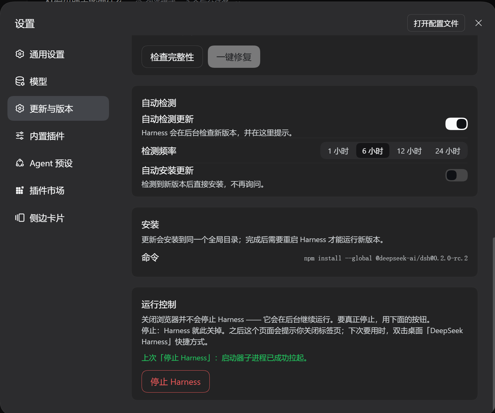

# dsh-update-center

[](https://github.com/Yara2090/dsh-update-center/actions/workflows/test.yml)
[](LICENSE)


给 **DeepSeek Harness** Web 设置面板加一个「**更新与版本**」页面：显示当前安装的
`@deepseek-ai/dsh` 版本、自动检测注册表上的新版本、一键装到同一个全局目录，并且能
**自检插件的完整性**（文件、依赖、配置）并在缺东西时一键修复。

> 一个 DSH Cordis 插件（Host + Client 双半边），纯 JavaScript，无构建步骤、无运行时依赖。

English summary: an "Updates & Version" settings page for the DeepSeek Harness Web GUI.
It reads the running `@deepseek-ai/dsh` version, checks the npm registry for a newer
release on a selectable channel, and installs it into the same global prefix. It also
self-checks its own installation (files, links, settings) and repairs the parts that can
be repaired safely. Plain ESM, no bundler, no runtime dependencies; the browser half only
imports `react`.


*设置 → 更新与版本：已安装与最新版本、更新通道、上次检测，以及完整性自检逐项结果。*

---

## 目录

- [界面与功能](#界面与功能)
- [完整性检查与一键修复](#完整性检查与一键修复)
- [运行控制：停止](#运行控制停止)
- [工作原理](#工作原理)
- [HTTP 接口](#http-接口)
- [安装](#安装)
- [配置](#配置)
- [开发与测试](#开发与测试)
- [目录结构](#目录结构)
- [安全边界](#安全边界)
- [已知限制](#已知限制)
- [更新日志](#更新日志)
- [许可](#许可)

---

## 界面与功能

页面注册在设置面板的 `settings.section` 插槽，导航位置 `order: 12`（「模型」之后、「插件」之前）。

| 卡片 | 内容 |
|---|---|
| **版本信息** | 已安装版本、最新版本（按通道）、更新通道切换（稳定版 / 预览版）、状态行、上次检测时间、「立即检查」、「立即更新」 |
| **完整性检查** | 10 项自检结果（文件 / 依赖 / 配置 / 运行环境）、「检查完整性」、「一键修复」 |
| **自动检测** | 自动检测开关、检测频率（1 / 6 / 12 / 24 小时）、自动安装开关（默认关闭，开启时给出风险提示） |
| **安装** | 将执行的完整命令、**安装进度**（不确定进度条 + 已用时长 / 已下载字节 / 速率 / 已取包数）、安装输出实时回显、安装结果与总耗时、以及「需要重启才生效」的提示 |
| **运行控制** | 「停止 Harness」（点两次确认）；停止后弹出浮层并自动尝试关闭标签页，浏览器不允许时提示按 Ctrl+W |



*同一页往下：自动检测频率与自动安装开关、将执行的完整安装命令、「停止 Harness」。*

几个刻意的行为：

- **不把「读不懂」当成「已是最新」**：定位不到安装版本、或注册表没返回所选标签时，
  页面显示明确的状态/错误，而不是绿色的「已是最新」。
- **不自动降级**：本机跑预发布版、注册表上的 `latest` 还是更旧的稳定版时，判定为「无更新」。
- **更新完成但未重启时**，页面同时列出「已安装」和「运行中」两个版本，说明磁盘上已经是新版、进程里仍是旧代码。
- **空闲时零请求**：只有检测或安装进行中才以 1s 轮询状态，其余时间页面完全不访问后端。
- **不编造百分比**：npm 不告诉调用者「总共要下多少」，所以进度条是不确定态，旁边给的是
  真实数字（时间、字节、速率、包数），而不是一个看起来精确、实际瞎猜的百分数。

### 安装期间看得见什么

`npm install --global` 的进度条只在 TTY 下画；输出被父进程用管道接走之后它一个字都不吐，
调试日志也要等进程结束才落盘。结果是「正在下载 100 MB」和「已经卡死」在页面上长得一模一样。

这个面板用四条互相独立的信号把它拆开：

| 信号 | 来源 | 说明 |
|---|---|---|
| 已用时长 | 1s 心跳（Host 侧） | 只要进程活着就一直在走 |
| 已下载 / 速率 | 直接量 npm 下载缓存 `_cacache/content-v2` 的体积 | **静默下载大压缩包时唯一还会增长的信号** |
| 已取包数 | `--loglevel=http` 打出的 `npm http fetch` 行 | 只在真的拿到应答时增加 |
| 静默提示 | 上述活动时间距现在超过 90 秒 | 给一句「npm 在下载/解包阶段本来就不输出」的说明，而不是假装一切正常 |

安装命令因此带上了 `--loglevel=http`（pnpm 用 `--reporter=append-only`），让安装器在管道里也开口说话。

## 完整性检查与一键修复

插件由三部分组成：**插件目录里的文件**、**profile 里的注册与链接**、**运行环境的配置**。
任何一处缺了，表现出来的都是「页面不见了」或「点了没反应」，很难从现象反推原因。
这一页把三部分逐项查一遍，并把其中能安全修的修掉。

十项检查（进入页面时自动跑一次，纯磁盘只读）：

| 检查项 | 查什么 | 一键修复 |
|---|---|---|
| 插件文件 | 清单声明的入口、图标、语言包等是否都在 | — |
| 插件清单 | `package.json` 能否解析，`name` / `version` / `dsh.bundle.patch` / `dsh.client` 是否齐全 | — |
| 源码依赖 | 顺着相对导入走一遍宿主半边，用到的文件是否都存在；有没有依赖没随插件交付的外部包 | — |
| 浏览器半边 | `client.js` 是否完整（含模块加载标记） | — |
| profile 注册 | profile 清单里的依赖项与 `dsh.profile.bundles` 是否都指向本插件 | ✅ 补回缺失项（先备份） |
| profile 链接 | `node_modules/@local/dsh-update-center` 是否存在且指向插件目录 | ✅ 重建链接（只删链接，绝不碰它指向的目录） |
| 偏好文件 | `<DSH_HOME>/dsh-update-center.json` 是否还是合法 JSON | ✅ 用当前设置重写（先备份） |
| DSH 主目录可写 | 状态与偏好需要落盘的地方是否可写 | ✅ 创建目录 |
| Node 版本 | 是否 ≥ 20 | — |
| Harness 安装 | 能否定位全局安装的 `@deepseek-ai/dsh` | — |

几条刻意的规矩：

- **检查永远只读**，只有点「一键修复」才写磁盘，而且每一项都**先备份**（同名 `.bak`）。
- **修复只补不删**：往 profile 清单里补缺失的依赖项与 bundle 条目，绝不动用户已有的其它内容，
  因此反复点也不会越改越乱（幂等）。
- **不确定就不动手**：链接位置如果是普通目录，脚本不会去删它——那可能是别人手工拷贝的一份
  插件（提示「是拷贝而不是链接」），也可能是别的东西占了名字（报错并让人工处理）。
- **修完把新的自检结果一并返回**，页面直接显示修好之后的样子，而不是让用户再点一次检查。

## 运行控制：停止

**关闭浏览器并不会停止 Harness。** 关标签页只是断开连接，服务仍在后台跑着——这个误会会让人以为「改了代码页面却没变」，所以「停止」直接做进设置页。

这里**只有一个动作：停止**。曾经还有一个「重启」，但两个按钮带来的是「我到底点的是哪个、接下来会发生什么」的持续困惑；而"停止 + 用桌面快捷方式启动"本来就是同一条路径，少一个概念就少一处误解。

- 「停止 Harness」需要**点两次**确认，第二次才真的执行。
- 动作**延后约 1.5 秒**执行，并且做成独立子进程——要被停掉的正是这个进程，HTTP 回包必须先发出去。
- **不自己实现杀进程**，而是调用你机器上原有的 `stop-deepseek-harness.ps1`（由安装器放在 `<DSH_HOME>` 下）。认端口、清状态这些细节只有一份实现，行为与桌面快捷方式完全一致。
- 脚本缺失时**按钮禁用**，并在页面上写明缺的是哪个文件，而不是让按钮点了没反应。
- **Windows 上不能给子进程加 `detached`**：它会带来 `DETACHED_PROCESS`（新进程没有控制台），
  而 Windows PowerShell 在这种状态下会以退出码 0 静默退出、一行脚本都不执行。Windows 本来
  就不会因为父进程退出而杀掉子进程，所以这里不需要它。
- 卡片上常驻一行**「上次动作」**：子进程是否真的起来了由 `spawn` / `error` 事件上报，
  并**写进偏好文件跨重启保留**（动作会把进程换掉，只有落盘才答得了「刚点的按钮生效没有」）。
- 安装进行中拒绝停止（`409`），避免把正在跑的安装器一起带走。

### 点完之后：关掉这个标签页

停止一旦执行，这个页面的连接就注定回不来（服务已经不在了，没有任何东西能再服务它）。所以动作排定后会盖一层浮层，说明「服务即将关闭、这个标签页可以关掉了」，并**自动尝试关闭标签页**。

**但浏览器通常不允许页面关闭自己。** 实测（Chromium/Edge）：

```
history.length = 2, window.opener = false   → window.close() 被拒绝，标签页仍在
```

Chromium 只允许「由脚本打开的」或「没有历史记录的」标签页被脚本关闭；而这里的页面是启动器从外部打开的（带令牌的地址 303 之后还留下了两条历史）。既然做不到，页面就不能假装做到了：调用之后等一小段时间，如果代码还在跑就说明被拒绝，于是**如实提示按 Ctrl+W 关闭**，而不是留一个转圈的界面。


## 工作原理

```
┌──────────────────────── 浏览器 ────────────────────────┐
│  client.js → settings.section 页面                     │
│    fetch('/dsh-update-center/state' | '/check' | ...)  │
└───────────────────────────┬────────────────────────────┘
                            │ 同源 HTTP，仅回环
┌───────────────────────────▼────────────────────────────┐
│  index.js  → ctx.webServer.register(prefix)            │
│  lib/center.js   状态机 / 路由 / 自动检测 / 安装子进程   │
│  lib/integrity.js 自检与修复：文件、链接、注册、环境      │
│  lib/lifecycle.js 停止服务：调用本机停止脚本并安排脱离本进程的执行 │
│  lib/progress.js 进度信号：缓存体积、抓取计数、静默判定   │
│  lib/semver.js   版本解析与 semver 优先级比较            │
│  lib/installation.js  定位安装目录、探测包管理器         │
└────────────────────────────────────────────────────────┘
```

- **Host 半边**（`index.js` + `lib/`）持有三件浏览器拿不到的事实：本机安装的版本、
  注册表发布的版本、以及「把新版装上去」的能力。它注册一条前缀路由
  `/dsh-update-center`，并把状态、检查、偏好、安装、自检、修复六个动作暴露成 JSON。
- **Client 半边**（`client.js`）只从浏览器模块表取 `react`，不 import 任何 Harness
  Client 包——那些包会随版本变化，而这个页面崩溃会让整个 slot entry 变空。
- **偏好落盘**到 `<DSH_HOME>/dsh-update-center.json`（通道、自动检测、自动安装、频率、
  上次检测时间）。运行期数据（安装输出、错误）只留在内存里。

## HTTP 接口

所有路由都在前缀 `/dsh-update-center` 之下，返回 `application/json; charset=utf-8`，
并且**只接受来自本机回环地址的请求**，非回环一律 `403`。

| 方法 | 路径 | 作用 |
|---|---|---|
| `GET` | `/dsh-update-center/state` | 读取完整状态快照 |
| `POST` | `/dsh-update-center/check` | 查注册表；可带 `{"channel":"latest"\|"next"}`；等检测完成再返回 |
| `POST` | `/dsh-update-center/settings` | 写偏好，字段 `channel` / `autoCheck` / `autoInstall` / `checkIntervalHours` |
| `POST` | `/dsh-update-center/update` | 启动安装；立即返回，进度靠轮询 `/state` |
| `GET` | `/dsh-update-center/integrity` | 跑一次完整性自检（只读），返回检查报告 |
| `POST` | `/dsh-update-center/repair` | 修复可自动处理的项，返回动作清单与**修复后**的新报告 |
| `POST` | `/dsh-update-center/stop` | 安排停止服务；约 1.5 秒后执行，因此回包会先返回 |

> 没有 `/restart`：重启服务请用桌面快捷方式（见「运行控制：停止」一节）。

状态对象的主要字段：

| 字段 | 含义 |
|---|---|
| `currentVersion` | 磁盘上已安装的版本（安装成功后会刷新） |
| `runningVersion` | 本进程启动时加载的版本 |
| `latestVersion` | 所选通道在注册表上的版本 |
| `updateAvailable` | 是否确实有更新（`false` 也包含「无法判定」） |
| `checking` / `checkedAt` / `checkError` | 检测中 / 上次检测时间 / 检测错误（无错误为 `null`） |
| `updating` / `updateOutput` / `updateResult` | 安装中 / 安装输出 / 安装结果 |
| `updateStartedAt` / `updateElapsedMs` / `updateFinishedAt` | 安装开始时间 / 已用毫秒（心跳刷新，结束即冻结） / 结束时间 |
| `updateCacheBytes` / `updateCacheRate` | 已下载字节（npm 缓存实量，估算值） / 字节每秒 |
| `updateFetchCount` / `updatePackageCount` | 已完成的注册表抓取次数 / 其中的压缩包数 |
| `updateSilentMs` / `updateStalled` | 距上次活动的毫秒数 / 是否已静默超过 90 秒 |
| `installCommand` | 将执行（或已执行）的完整命令 |
| `restartRequired` | 是否已装上磁盘但还没重启 |
| `channels` / `statePath` | 允许的通道列表 / 偏好文件路径 |
| `lifecycle` | `{ canStop, stopper }`：本机能不能停止，以及停止脚本的路径 |

自检报告（`/integrity` 与 `/repair` 共用同一形状）：

| 字段 | 含义 |
|---|---|
| `pluginRoot` / `pluginName` / `profileDir` / `statePath` | 本次自检认定的插件目录 / 包名 / profile 目录（判定不出为 `null`）/ 偏好文件 |
| `summary` | `errors` / `warnings` / `repairable` / `total` 计数 |
| `checks[]` | 每项为 `{ id, status, repairable, detail }`；`status` 取 `ok` / `warn` / `error` |
| `/repair` 额外返回 | `repaired[]`（含每项的 `ok` 与说明）、`repairedCount`、`failedCount`、`restartRequired`、以及修复后的 `report` |

## 安装

两种方式，任选一种。前提：已经装好 **Node ≥ 20** 和 **DeepSeek Harness**。

### 方式一：纯手动

```powershell
# 1. 下载
git clone https://github.com/Yara2090/dsh-update-center.git C:\dsh\dsh-update-center

# 2. 装进 web profile（装依赖）
dsh plugin --profile web add "file:C:\dsh\dsh-update-center"
```

3. 让插件真正启用：打开 `~/.dsh/profiles/web/package.json`，在 `dsh.profile.bundles` 里加上一行
   `"@local/dsh-update-center"`。

   > 这一步别省：`dsh plugin add` 只装依赖，不写 bundle 列表。少了它，插件不会被加载，
   > 设置里也就不会出现「更新与版本」。

4. 重启 Harness，打开 **设置 → 更新与版本**。

### 方式二：把 GitHub 地址交给 DSH，让它装

在 Harness 的对话框里发一句：

> 把 https://github.com/Yara2090/dsh-update-center 装成插件

DSH 会自己克隆、装依赖、并把插件写进 profile 的 bundle 列表；按它说的重启一次即可。

### 出问题时

| 现象 | 怎么办 |
|---|---|
| 设置里找不到「更新与版本」 | 多半是 bundle 列表没写进去；按方式一第 3 步检查 `dsh.profile.bundles` |
| 页面在，但卡片里报问题 | 点卡片里的「一键修复」，能补的它会补，补不了的会说明要你做什么 |
| 浏览器打不开这个页面 | 它只对本机回环地址开放，在跑 Harness 的那台机器上打开 |
| 提示找不到 `dsh` 命令 | 先 `npm i -g @deepseek-ai/dsh` |

装好之后基本不用管：默认每 6 小时自动查一次新版本，有新版就在这个页面里提示。

## 配置

写在 profile 的 `cordis.patch.yml` 覆盖行里，字段全部可选：

```yaml
- id: dsh-update-center
  name: "@local/dsh-update-center"
  config:
    channel: latest            # latest | next，默认 latest
    registry: "https://registry.npmjs.org/"   # 检测与安装都用的源，可换成内网镜像
    autoCheck: true            # 后台自动检测，默认 true
    autoInstall: false         # 检测到就自动安装，默认 false
    checkIntervalHours: 6      # 自动检测频率，默认 6
```

界面上能改的只有 `channel` / `autoCheck` / `autoInstall` / `checkIntervalHours`，
它们会落到偏好文件里并覆盖这里的默认值；`registry` 只能在配置里改，并且**检测与安装
用的是同一个源**（安装命令会带上 `--registry=<地址>`）。这样换成内网镜像后，检测到的
新版本也真的能从镜像装下来，不会出现「检测到有新版本、安装却从另一个源拉不到」。

## 开发与测试

无需安装依赖、无需构建：

```powershell
node --test                  # 95 个用例：版本比较 + 进度信号 + 自检与修复 + 停止计划 + 路由与拒绝分支 + 前后端接口一致性
node --check index.js        # 语法检查（client.js / lib/*.js 同理）
```

如果运行环境禁止 Node 测试运行器 fork 子进程（沙箱会报 `spawn EPERM`），
改用单进程模式：

```powershell
npm run test:single          # 等价于 node --test --test-isolation=none
```

测试不访问外网：注册表由本地假 HTTP 服务提供，偏好文件写在临时目录里，
也绝不会真的执行 `npm install`。

其中 `test/endpoints.test.js` 是**接口一致性检查**，不是功能测试：前端（`client.js`）与后端
（`lib/center.js`）靠字符串约定动作名，两边各改一半不会有任何报错，只会在运行时静默 404。
它断言三件事：前端调的每个动作后端都认、后端认的每个动作前端都在用、两边路由前缀一致；
检查自身也带非空断言，避免「什么都抽不到于是永远通过」。

推上去会自动跑同一套用例（见顶部徽章）：Ubuntu 上跑 Node 20 与 22，Windows 上跑 Node 22。
Windows 那条会让 `test/lifecycle.test.js` 里的 PowerShell 冒烟测试**真的执行**——那条用例
是「`detached` 让 PowerShell 静默退出」的产物，只在 Windows 上跑才有意义，其余平台自动跳过。
`index.js` 与 `client.js` 不被任何用例导入，因此 CI 里另外单独对它们跑 `node --check`。

改动 `client.js` 后，运行中的 Harness 会通过 bundle 探测自动热加载新的浏览器半边；
改动 Host 半边（`index.js` / `lib/`）通常需要重启 Harness 才会载入新的模块代。

## 目录结构

```
.
├── index.js              Host 半边入口：inject + apply，只做挂载
├── client.js             浏览器半边：单文件，settings.section 页面
├── lib/
│   ├── center.js         状态机、HTTP 路由、自动检测、安装子进程与进度心跳
│   ├── integrity.js      自检与一键修复：文件、源码依赖、profile 注册与链接、偏好文件
│   ├── lifecycle.js      停止：探测本机停止脚本并安排脱离本进程的执行
│   ├── progress.js       进度信号：缓存体积、抓取计数、静默判定（纯函数）
│   ├── semver.js         版本解析与 semver 优先级比较（纯函数）
│   └── installation.js   定位安装目录、探测包管理器、拼装安装命令
├── test/
│   ├── semver.test.js    版本比较的边界用例
│   ├── progress.test.js  进度信号与安装命令的边界用例
│   ├── integrity.test.js 自检判定与修复安全性（含「不误删真实目录」）
│   ├── lifecycle.test.js 停止的命令拼装与能力判定（含唯一真的拉起进程的 Windows 冒烟测试）
│   ├── center.test.js    路由 / 状态 / 拒绝分支 / 安装出口的版本号校验
│   └── endpoints.test.js 前后端接口一致性：动作名与路由前缀不许两边各改一半
├── locale/
│   ├── zh.json           插件卡片的中文显示名与描述
│   └── en.json           英文显示名与描述
├── docs/
│   ├── screenshot.png    README 顶部：版本信息与完整性检查
│   └── screenshot-2.png  「界面与功能」：自动检测、安装与运行控制
├── .github/workflows/
│   └── test.yml          CI：Ubuntu（Node 20/22）与 Windows（Node 22）跑 npm test
├── cordis.patch.yml      bundle 补丁：插入 Host 插件行
├── icon.svg              插件卡片图标
├── CHANGELOG.md          逐版本的功能与取舍记录
└── package.json          清单：dsh.bundle.patch + dsh.client
```

## 安全边界

这条路由能替换机器上的全局 npm 包，因此：

- **仅回环**：`req.socket.remoteAddress` 不是 `::1` / `127.0.0.0/8` / `::ffff:127.0.0.1`
  就直接 `403`，并且不返回任何状态；空地址也按拒绝处理。
- **不自动安装**：`autoInstall` 默认关闭，开启后界面会常驻一条风险提示。
- **同时只跑一个安装**：检测与安装互相排斥，重复请求返回 `409`。
- **插件卸载即收尾**：路由、定时器、正在运行的安装子进程都由 `ctx.effect` 的清理函数一起释放。
- **更新仍需重启**：安装只换磁盘上的文件，新版本要重启 Harness 才真正生效。
- **修复的写权限**：只有「一键修复」会写磁盘，范围仅限 profile 清单（补依赖项与 bundle 条目）、
  profile 里的插件链接、以及偏好文件；每项都先写同名 `.bak` 备份，且只补缺失、不删用户内容。
  检查（`GET /integrity`）永远只读。
  重建链接是唯一会删东西的动作，但它**只删链接本身**：链接指向的真实目录、以及「这里并不是
  链接」的情况，都绝不触碰。
- **停止不接受页面传来的任何命令**：它只会调用 `<DSH_HOME>` 下那个固定名字的脚本，页面能选的
  只有「停止」这一个已定义动作，不存在把任意命令拼进参数的可能。
- **进命令行的外部输入都先校验**：安装命令在 Windows 上经由 shell 执行（`shell: true`，因为
  npm / pnpm 是 `.cmd` 包装脚本），参数**不会被转义**。因此注册表返回的 dist-tag 必须能按
  semver 解析，配置里的 `registry` 必须是 `http`/`https` 的合法 URL——前者不合法就报错，
  后者不合法就退回官方源。这道校验有**两层**：读取注册表时一层，安装出口 `runUpdate` 自己
  再一层（安全闸不能只建在调用方）。

## 已知限制

- 需要 Node ≥ 20（用到全局 `fetch` 与 `AbortSignal.timeout`）。
- 安装用的是「同一个全局前缀 + 探测到的包管理器（npm / pnpm）」。如果这个包当初是用
  其它方式（例如手工拷贝）放进去的，探测会退回 `npm`，可能不符合你的环境；此时请手工
  执行界面上展示的那条命令。
- Windows 上正在运行的进程可能占住原生模块文件，导致全局安装失败；界面会把安装器的
  原始输出原样显示出来，按提示手动执行即可。
- **安装期间不要让本插件被卸载或重载**：插件被卸载时会一并终止正在运行的安装子进程
  （这是「不留孤儿 npm」的代价）。界面在安装中会常驻这条提示。
- npm 在解包阶段会连续几分钟不输出任何东西，此时进度条只靠时间与缓存体积证明进程还活着；
  真正「卡住」与「正在解包」在外部无法彻底区分，超过 90 秒静默时界面会给出说明而不是结论。
- 桌面（Electron）版的更新走 Harness 自带通道，与本插件无关。
- **一键修复只覆盖「能安全补回来」的部分**：插件源码文件丢了、Node 版本太低、Harness 没装，
  这些只能重新克隆仓库或自行升级，页面会如实说明而不是假装修好。
- 修复改的是 profile 清单与链接，因此改完之后**需要重启 Harness** 才生效（页面会提示）。
- 自检报告的文案由浏览器半边渲染，Host 只回 `id` 与细节字符串；因此新增检查项时忘记补文案，
  页面会退回显示检查项 id，而不是空白。
- 没有浏览器控制的环境下无法验证视觉呈现；本项目的验证覆盖语法、清单、Host 路由与
  实时 Client 插槽注册。

## 更新日志

完整历史与每一版的取舍理由见 **[CHANGELOG.md](CHANGELOG.md)**；
[Releases](https://github.com/Yara2090/dsh-update-center/releases) 里有对应的版本标签。

## 许可

[MIT](LICENSE)
